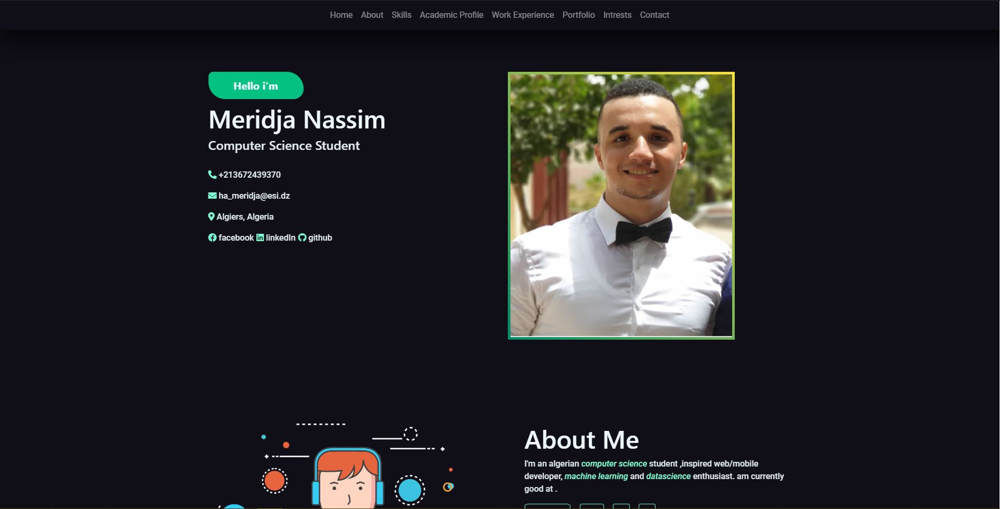
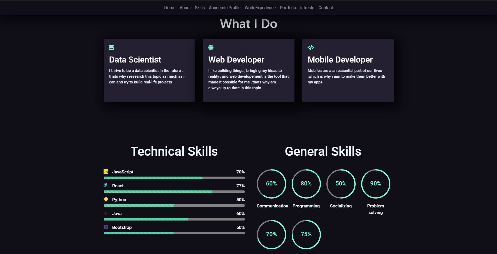
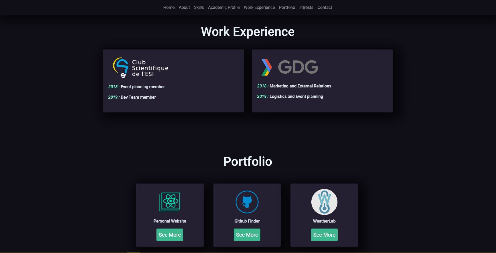
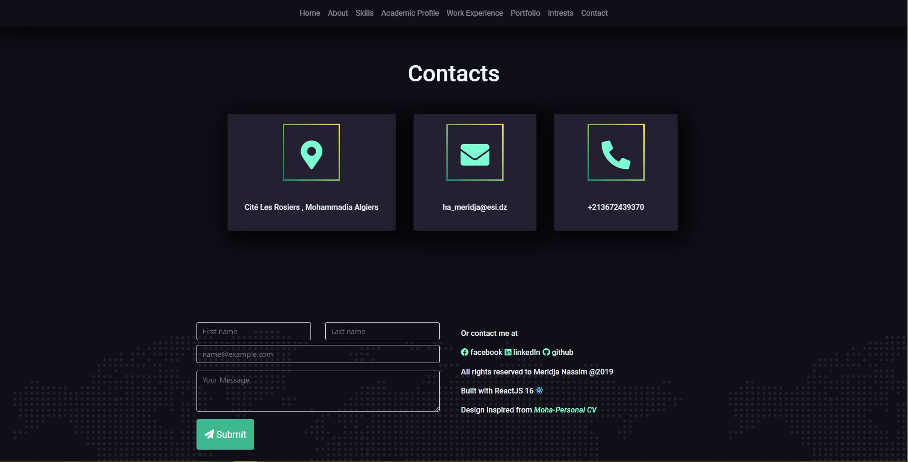

This project was bootstrapped with [Create React App](https://github.com/facebook/create-react-app).

# My Personal Website

This is my first Personal website created using ReactJS for the front-end . The design was inspired from the Template [Moha-Personal Website] (http://cvresumetemplate.com/maha-personal-cv-resume-html-template/home-one.html) . but was implemented entirely from scratch using ReactJS .

### `Screenshots Of the website .`

### `Packages Used`

*React-Bootstrap (styles)
*React-Reveal(Animations)

### Next Steps : 
*Implement the Backend for messages 
*Host it on Github Pages
